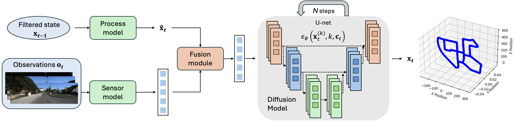

# DnDFilter
This repository is the official implementation of the paper 
["DnD Filter: Differentiable State Estimation for Dynamic Systems using Diffusion 
Models"](https://arxiv.org/abs/2503.01274), which has been submitted 
to 2025 IEEE/RSJ International Conference on Intelligent Robots and Systems (IROS 2025)



DnD Filter is a differentiable filter that utilizes diffusion models for state 
estimation of dynamic systems. Unlike conventional differentiable filters, which 
often impose restrictive assumptions on process noise (e.g., Gaussianity), DnD Filter 
enables a nonlinear state update without such constraints by conditioning a diffusion 
model on both the predicted state and observational data, capitalizing on its ability to
approximate complex distributions. To the best of our knowledge, DnD Filter represents
the first successful attempt to leverage diffusion models for state estimation, offering
a flexible and powerful framework for nonlinear estimation under noisy measurements.

# Overview
This repository provides training and validating code for DnD Filter and trained model 
checkpoints.

- `./train/train.py`: training script to train DnD Filters and baselines.
- `./train/test_*.py`: validating script for DnD Filters and baselines.
- `./train/config/`: training configurations for DnD Filter and baselines.
- `./train/dataset/`: dataset used for training and validating.
- `./train/logs/`: the pretrained model checkpoints for DnD Filter and baselines.
- `./train/DND_train/`: contains model files for DND Filter and baselines.

# Getting Started
Run the commands below inside the topmost directory:
1. Set up the conda environment:
    ```bash
    conda env create -f train/train_environment.yml
    ```
2. Source the conda environment:
    ```
    conda activate DnD_Filter
    ```
3. Install the `diffusion_policy` package from this [repo](https://github.com/real-stanford/diffusion_policy):
    ```bash
    git clone git@github.com:real-stanford/diffusion_policy.git
    pip install -e diffusion_policy/
    ```
# Training and Validating
For training, modify the configuration file in `train.py` to match the training objective
model, then directly run `train.py`.

For validating, Run the corresponding `test_*` files in the `train/` folder.

To train from a existing checkpoints, Add 
```bash
    load_run: <project_name>/<log_run_name>
```
to `.yaml` config file in `./train/config/`. The `*.pth` of the file you are 
loading to be saved in this file structure and renamed to “latest”: 
```bash
   ./train/logs/<project_name>/<log_run_name>/latest.pth. 
```

# Dataset
1. The simulated disk tracking dataset can be generated using codes in 
[repo](https://github.com/tiboat/BackpropKF_Reproduction). 
2. KITTI Visual Odometry Dataset 
(https://www.cvlibs.net/datasets/kitti/eval_odometry.php)

The dataset should be processed into following structure:
```
├── <dataset_name>
│   ├── <name_of_traj1>
│   │   ├── 0.pt
│   │   ├── 1.pt
│   │   ├── ...
│   │   ├── T_1.pt
│   │   ├── traj_data.pkl
│   │   └── traj_data.txt
│   ├── <name_of_traj2>
│   │   ├── 0.pt
│   │   ├── 1.pt
│   │   ├── ...
│   │   ├── T_2.pt
│   │   ├── traj_data.pkl
│   │   └── traj_data.txt
│   ...
└── └── <name_of_trajN>
    	├── 0.pt
    	├── 1.pt
    	├── ...
        ├── T_N.pt
        ├── traj_data.pkl
        └── traj_data.txt
```  
`*.pt` containes the high-dimensional observation (e.g.,images) and `traj_data.pkl`
and `traj_Data.txt` contain related data of the sequence.

The processed dataset we used can be found in [DataLink](https://huggingface.co/datasets/ZIYUNUS/DnD_Filter)

## Citation
* Please cite the paper if you used any materials from this repo, Thanks.
```
@article{liu2023enhancing,
  title={Enhancing State Estimation in Robots: A Data-Driven Approach with Differentiable Ensemble Kalman Filters},
  author={Liu, Xiao and Clark, Geoffrey and Campbell, Joseph and Zhou, Yifan and Amor, Heni Ben},
  journal={arXiv preprint arXiv:2308.09870},
  year={2023}
}
```

# More details are coming soon.
